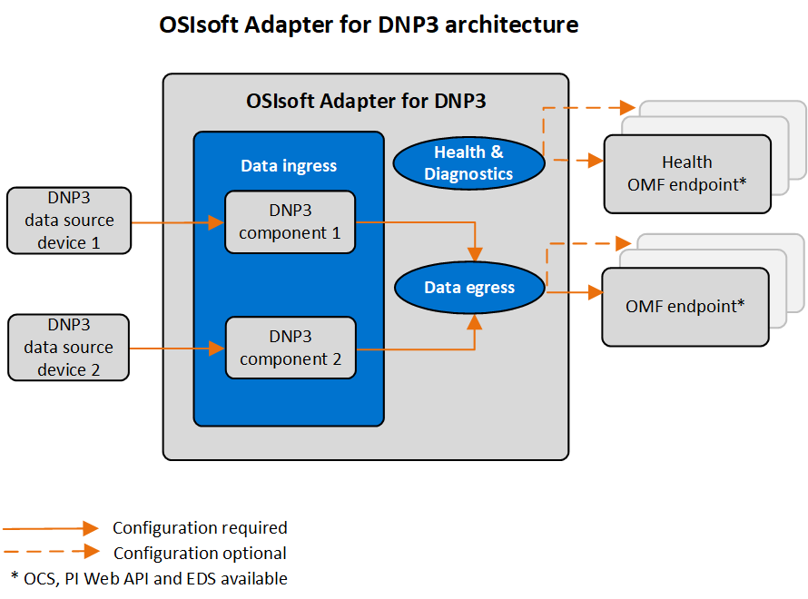

# OSIsoft Adapter for DNP3 overview

The OSIsoft Adapter for DNP3 is a data-collection component that transfers time-series data from source devices to OSIsoft OMF endpoints in OSIsoft Cloud Services or PI Servers. DNP3 is a communication protocol commonly used in SCADA networks. The protocol is maintained by the DNP Users Group, and it is defined by IEEE Std 1815-2012. The adapter adheres to this standard and operates as a DNP3-L1 compliant master station,  which may communicate with compliant outstations by TCP/IP.

The adapter is installed with a download kit obtained from the OSIsoft Customer Portal and works on devices running either Windows or Linux operating systems.

All functions of the adapter are configured using REST API. The configurations are stored in JSON files.
For data ingress, an adapter component must be defined in the system components configuration for each device to which the adapter will connect. Each adapter component is then configured with the connection information for the device and the data to collect.
For data egress, configuration is needed to specify destinations for the data, including security for the outgoing connection. Additional configurations are available to egress health and diagnostics data, add buffering configuration to protect against data loss, and record logging information for troubleshooting purposes.

Once the adapter is configured and sending data, administration functions are used to manage the adapter or individual ingress components of the adapter. Health and diagnostics functions monitor the status of connected devices, adapter system functions, the number of active data streams, the rate of data ingress, the rate of errors, and the rate of data egress.

The EdgeCmd utility is an OSIsoft proprietary command line tool that is used to configure and administer an adapter on both Linux and Windows operating systems. It is installed separately from the adapter.

<!--
# OSIsoft Adapter for DNP3

=======

- [OSIsoft Adapter for DNP3 overview](xref:OSIsoftAdapterForDNP3Overview)
  - [OSIsoft Adapter for DNP3 principles of operation](xref:OSIsoftAdapterForDNP3PrinciplesOfOperation)
  - [OSIsoft Adapter for DNP3 supported features](xref:OSIsoftAdapterForDNP3SupportedFeatures)
- [Installation](xref:Installation)
  - [Install the adapter](xref:InstallTheAdapter)
  - [Install OSIsoft Adapter for DNP3 using Docker](xref:InstallOSIsoftAdapterForDNP3UsingDocker)
  - [Uninstall the adapter](xref:UninstallTheAdapter)
- [Configuration](xref:ModbusConfiguration)
  - [Configuration tools](xref:ConfigurationTools)
  - [System components configuration](xref:SystemComponentsConfiguration)
  - [OSIsoft Adapter for DNP3 data source configuration](xref:OSIsoftAdapterForDNP3DataSourceConfiguration)
  - [OSIsoft Adapter for DNP3 data selection configuration](xref:OSIsoftAdapterForDNP3DataSelectionConfiguration)
  - [Egress endpoints configuration](xref:EgressEndpointsConfiguration)
  - [Health endpoint configuration](xref:HealthEndpointConfiguration)
  - [Diagnostics configuration](xref:DiagnosticsConfiguration)
  - [Buffering configuration](xref:BufferingConfiguration)
  - [Logging configuration](xref:LoggingConfiguration)
  - [System and adapter configuration](xref:SystemAndAdapterConfiguration)
- [Administration](xref:Administration)
  - [Start and stop an adapter](xref:StartAndStopAnAdapter)
  - [Start and stop ingress component](xref:StartAndStopIngressComponent)
  - [Retrieve product version information](xref:RetrieveProductVersionInformation)
  - [Delete an adapter component](xref:DeleteAnAdapterComponent)
- [Health and diagnostics](xref:HealthAndDiagnostics)
  - [Adapter health](xref:AdapterHealth)
    - [Device status](xref:DeviceStatus)
    - [Next health message expected](xref:NextHealthMessageExpected)
  - [Adapter diagnostics](xref:AdapterDiagnostics)
    - [System](xref:System)
    - [Stream count](xref:StreamCount)
    - [IO rate](xref:IORate)
    - [Error rate](xref:ErrorRate)
  - [Egress diagnostics](xref:EgressDiagnostics)
-->
